# Architecture Diagrams

**Project**: Infra-OlDevOps
**Version**: 1.0
**Date**: 2026-01-07

This document contains visual architecture diagrams using Mermaid.

---

## Table of Contents

1. [Current State Network Architecture](#1-current-state-network-architecture)
2. [Current State Service Architecture](#2-current-state-service-architecture)
3. [Future State Network Architecture](#3-future-state-network-architecture)
4. [Future State Service Architecture](#4-future-state-service-architecture)
5. [CI/CD Pipeline Architecture](#5-cicd-pipeline-architecture)
6. [Observability Stack Architecture](#6-observability-stack-architecture)
7. [Deployment Flow](#7-deployment-flow)

---

## 1. Current State Network Architecture


---

## 2. Current State Service Architecture


---

## 3. Future State Network Architecture

```mermaid
graph TB
    subgraph Internet
        Users[Users/Recruiters]
        GitHub[GitHub Actions<br/>Self-Hosted Runner]
    end

    subgraph "BBox Router (192.168.1.254)"
        Router[NAT: 80/443 → .200]
    end

    subgraph "Proxmox VE Host"
        Backup[Automated Backup<br/>Daily Snapshots<br/>OVH S3 Offsite]

        subgraph "Bridge vmbr0 (192.168.1.0/24)"
            Proxy[LXC: proxy<br/>VMID 200<br/>192.168.1.200<br/>2C / 1GB / 8GB]
            Utils[LXC: utilities<br/>VMID 220<br/>192.168.1.201<br/>6C / 8GB / 40GB]
            Monitor[LXC: monitoring<br/>VMID 240<br/>192.168.1.202<br/>4C / 6GB / 50GB]
            AppDemo[LXC: app-demo 🆕<br/>VMID 210<br/>192.168.1.210<br/>2C / 2GB / 20GB]
        end
    end

    Users -->|HTTPS| Router
    Router -->|Port Forward| Proxy
    GitHub -.->|SSH Deploy| Proxy
    GitHub -.->|SSH Deploy| Utils
    GitHub -.->|SSH Deploy| Monitor
    GitHub -.->|SSH Deploy| AppDemo

    Proxy -->|HTTP| Utils
    Proxy -->|HTTP| Monitor
    Proxy -->|HTTP| AppDemo

    Backup -.->|Snapshot| Proxy
    Backup -.->|Snapshot| Utils
    Backup -.->|Snapshot| Monitor
    Backup -.->|Snapshot| AppDemo

    subgraph "proxy services"
        Traefik[Traefik v3<br/>Reverse Proxy + SSL<br/>Security Headers 🆕<br/>Rate Limiting 🆕]
        Promtail1[Promtail 🆕<br/>Log Agent]
    end

    subgraph "utilities services"
        Vault[Vaultwarden<br/>:8082]
        Snipe[Snipe-IT<br/>:8081]
        Netbox[NetBox<br/>:8084]
        Promtail2[Promtail 🆕<br/>Log Agent]
    end

    subgraph "monitoring services"
        Zabbix[Zabbix<br/>:8083]
        Kuma[Uptime Kuma<br/>:3001]
        Prom[Prometheus<br/>:9090]
        Graf[Grafana<br/>:3000]
        Loki[Loki 🆕<br/>:3100<br/>Log Aggregation]
        Promtail3[Promtail 🆕<br/>Log Agent]
    end

    subgraph "app-demo services 🆕"
        Frontend[React Frontend<br/>:3000<br/>TypeScript + Vite]
        Backend[Node.js API<br/>:5000<br/>Express + TypeScript]
        DB[PostgreSQL<br/>:5432]
        Promtail4[Promtail 🆕<br/>Log Agent]
    end

    Proxy --> Traefik
    Proxy --> Promtail1
    Utils --> Vault
    Utils --> Snipe
    Utils --> Netbox
    Utils --> Promtail2
    Monitor --> Zabbix
    Monitor --> Kuma
    Monitor --> Prom
    Monitor --> Graf
    Monitor --> Loki
    Monitor --> Promtail3
    AppDemo --> Frontend
    AppDemo --> Backend
    AppDemo --> DB
    AppDemo --> Promtail4

    Frontend --> Backend
    Backend --> DB

    Promtail1 -.->|Logs| Loki
    Promtail2 -.->|Logs| Loki
    Promtail3 -.->|Logs| Loki
    Promtail4 -.->|Logs| Loki

    Graf -.->|Query Logs| Loki
    Graf -.->|Query Metrics| Prom

    style Proxy fill:#e1f5ff
    style Utils fill:#fff4e1
    style Monitor fill:#e8f5e8
    style AppDemo fill:#ffe8f5
    style Backup fill:#fff9e6
```



---

## 4. Future State Service Architecture


---

## 5. CI/CD Pipeline Architecture


---

## 6. Observability Stack Architecture


---

## 7. Deployment Flow

```mermaid
sequenceDiagram
    participant Dev as Developer
    participant Git as GitHub
    participant CI as GitHub Actions
    participant Runner as Self-Hosted Runner
    participant PVE as Proxmox VE
    participant TF as Terraform
    participant Ansible as Ansible
    participant LXC as LXC Containers

    Dev->>Git: git push (create PR)
    Git->>CI: Trigger validation workflows
    CI->>Runner: Run terraform validate
    Runner->>Runner: terraform fmt -check
    Runner->>Runner: terraform validate
    Runner->>Runner: tfsec scan
    Runner-->>CI: ✅ Validation passed

    CI->>Runner: Run ansible lint
    Runner->>Runner: ansible-lint
    Runner->>Runner: ansible-playbook --syntax-check
    Runner-->>CI: ✅ Lint passed

    CI->>Runner: Run security scan
    Runner->>Runner: git-secrets
    Runner->>Runner: Trivy scan
    Runner-->>CI: ✅ Security passed

    CI-->>Git: ✅ All checks passed
    Dev->>Git: Merge PR to main

    Git->>CI: Trigger deployment workflow
    CI-->>Dev: ⏸️ Awaiting manual approval
    Dev->>CI: ✅ Approve deployment

    CI->>Runner: Start deployment
    Runner->>PVE: Create snapshots (all LXCs)
    PVE-->>Runner: ✅ Snapshots created

    Runner->>TF: terraform init
    Runner->>TF: terraform apply -auto-approve
    TF->>PVE: Create/update LXC containers
    PVE-->>TF: ✅ Containers ready
    TF-->>Runner: ✅ Infrastructure deployed

    Runner->>Ansible: ansible-playbook playbooks/*
    Ansible->>LXC: SSH connection
    Ansible->>LXC: Install Docker, services
    Ansible->>LXC: Configure applications
    LXC-->>Ansible: ✅ Services running
    Ansible-->>Runner: ✅ Configuration complete

    Runner->>LXC: Health checks (curl URLs)
    LXC-->>Runner: HTTP 200 OK
    Runner-->>CI: ✅ Deployment successful
    CI-->>Git: Comment on PR
    Git-->>Dev: 📧 Deployment notification

    alt Health Check Failure
        LXC-->>Runner: ❌ HTTP error
        Runner->>PVE: Restore snapshots
        PVE-->>Runner: ✅ Rollback complete
        Runner-->>CI: ⚠️ Deployment failed, rolled back
        CI-->>Git: Comment on PR
        Git-->>Dev: 📧 Failure notification
    end
```



---

## 8. Security Architecture

```mermaid
graph TB
    subgraph "External Threats"
        Internet[Internet Traffic]
        Attacker[Potential Attackers]
    end

    subgraph "Perimeter Security"
        Router[BBox Router<br/>NAT + Firewall]
        Traefik[Traefik<br/>Rate Limiting<br/>TLS 1.3<br/>Security Headers]
    end

    subgraph "Container Security (all LXCs)"
        UFW[UFW Firewall<br/>Whitelist Rules]
        Fail2ban[Fail2ban<br/>SSH Protection]
        Updates[Unattended Upgrades<br/>Auto Security Patches]
    end

    subgraph "Application Security"
        SSL[Let's Encrypt SSL<br/>DNS-01 Challenge]
        Auth[Service Authentication<br/>JWT, User/Pass]
        HTTPS[HTTPS Only<br/>HTTP → HTTPS Redirect]
    end

    subgraph "CI/CD Security"
        PreCommit[Pre-Commit Hooks<br/>git-secrets<br/>detect-secrets]
        TFSec[tfsec<br/>Terraform Security]
        Trivy[Trivy<br/>Docker Image Scan]
        OWASP[OWASP Dependency<br/>Check]
    end

    subgraph "Secrets Management"
        AnsibleVault[Ansible Vault<br/>AES256 Encrypted]
        GitHubSecrets[GitHub Secrets<br/>Encrypted Storage]
        NoGit[.gitignore<br/>No secrets in Git]
    end

    Internet --> Router
    Attacker --> Router
    Router --> |Port 80/443| Traefik
    Traefik --> UFW
    UFW --> Fail2ban
    Fail2ban --> Updates

    Traefik --> SSL
    SSL --> Auth
    Auth --> HTTPS

    PreCommit -.->|Prevent| NoGit
    TFSec -.->|Scan| Traefik
    Trivy -.->|Scan| UFW
    OWASP -.->|Check| Updates

    AnsibleVault -.->|Store| Auth
    GitHubSecrets -.->|Store| PreCommit

    style Router fill:#ff9999
    style Traefik fill:#ffcc99
    style UFW fill:#99ff99
    style SSL fill:#99ccff
    style PreCommit fill:#cc99ff
    style AnsibleVault fill:#ffcccc
```



---

## 9. Data Flow Diagram


---

## 10. Backup and Recovery Flow

```mermaid
graph TB
    subgraph "Scheduled Backup (Daily 2 AM)"
        Cron[Cron Job<br/>Proxmox Host]
    end

    subgraph "Backup Operations"
        Snapshot[Create LXC Snapshots<br/>All Containers]
        DBDump[Database Dumps<br/>PostgreSQL, MySQL]
        TFExport[Terraform State Export<br/>OVH S3]
        VaultBackup[Ansible Vault Backup<br/>secrets.yml]
    end

    subgraph "Local Storage"
        LocalBackup[/var/backups/<br/>infra-oldevops/<br/>Retention: 7 days]
    end

    subgraph "Offsite Storage"
        S3[OVH S3 Bucket<br/>Retention: 30 days<br/>Versioned]
    end

    subgraph "Monitoring"
        Alert[Backup Monitoring<br/>Success/Failure Alerts]
        Dashboard[Grafana Dashboard<br/>Last Backup Time]
    end

    subgraph "Recovery Operations"
        Restore[Restoration Script<br/>scripts/restore.sh]
        Verify[Verification<br/>Monthly Test]
    end

    Cron --> Snapshot
    Cron --> DBDump
    Cron --> TFExport
    Cron --> VaultBackup

    Snapshot --> LocalBackup
    DBDump --> LocalBackup
    TFExport --> LocalBackup
    VaultBackup --> LocalBackup

    LocalBackup --> |rclone sync| S3

    LocalBackup -.->|Monitor| Alert
    S3 -.->|Monitor| Alert
    Alert --> Dashboard

    S3 --> |Disaster Recovery| Restore
    Restore --> Verify

    style Cron fill:#fff4e1
    style LocalBackup fill:#e8f5e8
    style S3 fill:#99ccff
    style Alert fill:#ff9999
    style Restore fill:#ffcc99
```

---

## Notes on Diagrams

### Rendering
- All diagrams use **Mermaid** syntax
- Render automatically on GitHub
- Can be exported to PNG/SVG using Mermaid CLI or online editor

### Diagram Updates
- Update diagrams when architecture changes
- Version diagrams with code (in Git)
- Reference diagram version in ADRs

### Diagram Sources
- **Mermaid Live Editor**: https://mermaid.live/
- **Mermaid Documentation**: https://mermaid-js.github.io/mermaid/

### Legend

| Symbol | Meaning |
|--------|---------|
| → | Data flow / Traffic |
| -.-> | Monitoring / Logging / Reference |
| 🆕 | New component (future state) |
| Solid box | Existing component |
| Dashed box | External system |

---

**Document Version**: 1.0
**Last Updated**: 2026-01-07
**Next Review**: After each phase implementation
**Related Documents**:
- Brownfield Architecture Overview: `brownfield-architecture-overview.md`
- Current State Detailed: `current-state-detailed.md`

---

**Prepared by**: DevOps Architecture Team
