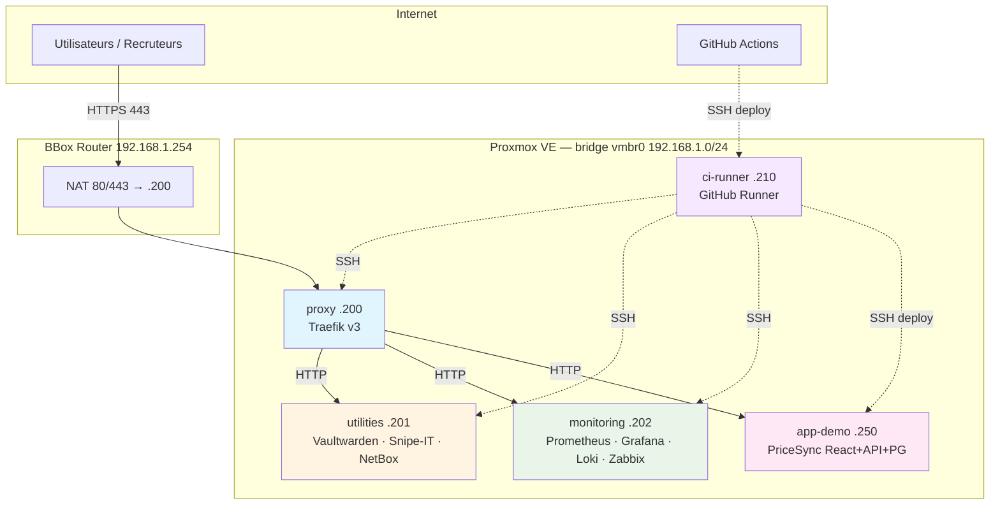
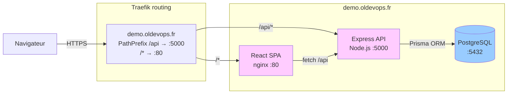
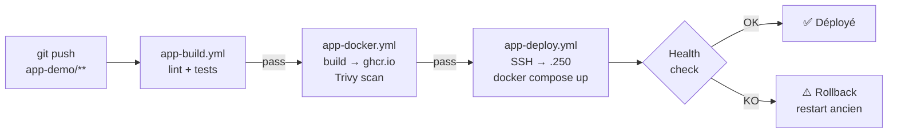

# Diagrammes d'Architecture — Infra-OlDevOps

**Version** : 1.0
**Dernière mise à jour** : 2026-02-20

Tous les diagrammes sont en **syntaxe Mermaid** — rendus automatiquement sur GitHub.

---

## Index des Diagrammes

Les diagrammes détaillés sont dans [`docs/architecture/architecture-diagrams.md`](../architecture/architecture-diagrams.md) :

| # | Diagramme | Description |
|---|-----------|-------------|
| 1 | [Réseau état actuel](../architecture/architecture-diagrams.md#1-current-state-network-architecture) | LXC, IPs, bridges Proxmox |
| 2 | [Services état actuel](../architecture/architecture-diagrams.md#2-current-state-service-architecture) | Routage Traefik → services |
| 3 | [Réseau état futur](../architecture/architecture-diagrams.md#3-future-state-network-architecture) | + ci-runner + app-demo + Loki |
| 4 | [Services état futur](../architecture/architecture-diagrams.md#4-future-state-service-architecture) | PriceSync + observabilité |
| 5 | [Pipeline CI/CD](../architecture/architecture-diagrams.md#5-cicd-pipeline-architecture) | GitHub Actions → deploy |
| 6 | [Stack observabilité](../architecture/architecture-diagrams.md#6-observability-stack-architecture) | Prometheus + Loki + Grafana |
| 7 | [Flux déploiement](../architecture/architecture-diagrams.md#7-deployment-flow) | Sequence diagram complet |
| 8 | [Sécurité](../architecture/architecture-diagrams.md#8-security-architecture) | Couches de sécurité |
| 9 | [Data flow](../architecture/architecture-diagrams.md#9-data-flow-diagram) | Requête HTTP → DB |
| 10 | [Backup & Recovery](../architecture/architecture-diagrams.md#10-backup-and-recovery-flow) | Backup quotidien + restore |

---

## Diagramme Réseau (État Actuel)

---

## Diagramme Application PriceSync

---

## Diagramme CI/CD

---

## Outils

- **Mermaid Live** : https://mermaid.live/ — éditer et prévisualiser
- **CLI export** : `npx @mermaid-js/mermaid-cli -i diagram.md -o diagram.svg`
