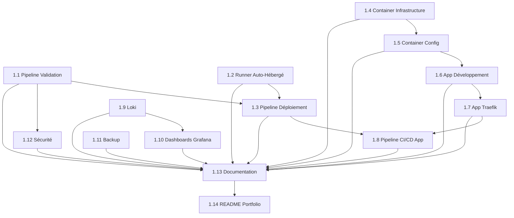

# Roadmap - Transformation Portfolio Infrastructure Professionnelle

**Version** : 1.0
**Dernière mise à jour** : 2026-01-07
**Epic** : [Transformation Portfolio Infrastructure Professionnelle](EPIC.md)

---

## Vue d'Ensemble

Ce document trace la progression de la transformation de l'infrastructure homelab en vitrine professionnelle. Le projet est organisé en 14 stories réparties en 5 phases.

**Objectif global** : Démontrer une maîtrise complète DevOps/SRE à travers un projet infrastructure concret, automatisé et documenté.

---

## Statut Global

| Métrique | Valeur | Cible |
|----------|--------|-------|
| Stories complétées | 0 / 14 | 14 |
| Progression | 0% | 100% |
| Phase actuelle | Phase 1 | Phase 5 |
| Durée estimée restante | 6-8 semaines | - |

**Dernière story complétée** : Aucune
**Prochaine story à démarrer** : [Story 1.1 - GitHub Actions - Pipeline de Validation Infrastructure](story-1.1.md)

---

## Phases du Projet

### 📊 Phase 1 : CI/CD Foundation (Semaines 1-2)

**Objectif** : Établir les fondations du pipeline CI/CD automatisé

| Story | Priorité | Effort | Statut | Notes |
|-------|----------|--------|--------|-------|
| [1.1 - Pipeline de Validation Infrastructure](story-1.1.md) | P0 | 5 | 📝 Todo | Workflows Terraform + Ansible |
| [1.2 - Runner Auto-Hébergé](story-1.2.md) | P0 | 3 | 📝 Todo | Accès réseau local |
| [1.3 - Pipeline de Déploiement Automatisé](story-1.3.md) | P0 | 8 | 📝 Todo | GitOps complet |

**Critères de validation Phase 1** :
- [ ] Pipeline CI/CD fonctionnel end-to-end
- [ ] Au moins 1 déploiement automatisé réussi
- [ ] Rollback testé et opérationnel
- [ ] Documentation pipeline créée

**Risques Phase 1** :
- 🔴 Runner ne peut pas accéder au réseau local → Mitigation : Cloudflare Tunnel
- 🟡 Workflows trop lents → Mitigation : Optimisation caching

---

### 🚀 Phase 2 : Application Démo (Semaines 3-5)

**Objectif** : Déployer une application moderne avec son pipeline complet

| Story | Priorité | Effort | Statut | Notes |
|-------|----------|--------|--------|-------|
| [1.4 - Container Application - Infrastructure Terraform](story-1.4.md) | P1 | 3 | 📝 Todo | Nouveau container LXC |
| [1.5 - Container Application - Configuration Ansible](story-1.5.md) | P1 | 5 | 📝 Todo | Provisioning Docker |
| [1.6 - Application de Démonstration - Développement Frontend/Backend](story-1.6.md) | P1 | 13 | 📝 Todo | Stack React + API |
| [1.7 - Application de Démonstration - Intégration Traefik](story-1.7.md) | P1 | 5 | 📝 Todo | SSL + routing |
| [1.8 - Application de Démonstration - Pipeline CI/CD](story-1.8.md) | P1 | 8 | 📝 Todo | Build + Deploy app |

**Critères de validation Phase 2** :
- [ ] Application accessible via `https://app.oldevops.fr`
- [ ] API fonctionnelle via `https://api.oldevops.fr`
- [ ] Pipeline CI/CD app fonctionnel
- [ ] Tests >60% coverage

**Risques Phase 2** :
- 🟡 Docker dans LXC ne fonctionne pas → Mitigation : Vérifier nesting + fallback privileged
- 🟡 Certificats SSL non générés → Mitigation : Vérifier DNS OVH + Traefik logs

---

### 📈 Phase 3 : Observabilité Avancée (Semaine 6)

**Objectif** : Implémenter une stack d'observabilité professionnelle

| Story | Priorité | Effort | Statut | Notes |
|-------|----------|--------|--------|-------|
| [1.9 - Monitoring Avancé - Loki pour Agrégation de Logs](story-1.9.md) | P2 | 5 | 📝 Todo | Logs centralisés |
| [1.10 - Monitoring Avancé - Dashboards Grafana Versionnés](story-1.10.md) | P2 | 5 | 📝 Todo | Dashboards IaC |

**Critères de validation Phase 3** :
- [ ] Loki collecte logs de tous les containers
- [ ] 3 dashboards Grafana créés et provisionnés
- [ ] Logs interrogeables dans Grafana Explore
- [ ] Dashboards versionnés dans Git

**Risques Phase 3** :
- 🟢 Impact performance Loki → Mitigation : Limiter ressources + rotation logs

---

### 🔒 Phase 4 : Opérations et Sécurité (Semaine 7)

**Objectif** : Sécuriser et rendre l'infrastructure résiliente

| Story | Priorité | Effort | Statut | Notes |
|-------|----------|--------|--------|-------|
| [1.11 - Backup et Disaster Recovery Automation](story-1.11.md) | P2 | 8 | 📝 Todo | Backup auto + DR |
| [1.12 - Sécurité - Scanning et Hardening Automatisé](story-1.12.md) | P2 | 8 | 📝 Todo | Security scans |

**Critères de validation Phase 4** :
- [ ] Backup quotidien fonctionnel
- [ ] Test de restoration réussi (RTO <30min)
- [ ] Scans de sécurité passent (pas de vulns critiques)
- [ ] Hardening appliqué sur tous les containers

**Risques Phase 4** :
- 🔴 Restoration échoue → Mitigation : Tests réguliers + documentation détaillée
- 🟡 Hardening casse services → Mitigation : Tests en isolation + snapshots

---

### 📚 Phase 5 : Documentation et Polish (Semaine 8)

**Objectif** : Finaliser la vitrine professionnelle

| Story | Priorité | Effort | Statut | Notes |
|-------|----------|--------|--------|-------|
| [1.13 - Documentation Professionnelle - Architecture et Runbooks](story-1.13.md) | P3 | 8 | 📝 Todo | Docs exhaustives |
| [1.14 - README et Portfolio - Transformation en Vitrine Professionnelle](story-1.14.md) | P3 | 5 | 📝 Todo | README + portfolio |

**Critères de validation Phase 5** :
- [ ] Documentation complète (architecture + runbooks + guides)
- [ ] README transformé en vitrine professionnelle
- [ ] Page portfolio créée dans l'app
- [ ] SHOWCASE.md créé
- [ ] Script vidéo préparé

**Risques Phase 5** :
- 🟢 Documentation obsolète → Mitigation : Revue régulière + CI/CD checks

---

## Légende des Statuts

- 📝 **Todo** : Story non démarrée
- 🏗️ **In Progress** : Story en cours de développement
- 🔄 **In Review** : Story en revue (PR ouverte)
- ✅ **Done** : Story complétée et mergée
- ⏸️ **Blocked** : Story bloquée (dépendances ou problème)
- ❌ **Cancelled** : Story annulée

## Légende des Priorités

- **P0** : Bloquant - requis pour la suite
- **P1** : Haute - fonctionnalités core
- **P2** : Moyenne - améliorations importantes
- **P3** : Basse - polish final

## Légende des Risques

- 🔴 **Élevé** : Impact majeur, nécessite attention immédiate
- 🟡 **Moyen** : Impact modéré, mitigation en place
- 🟢 **Faible** : Impact mineur, gérable

---

## Dépendances entre Stories

---

## Métriques de Succès du Projet

### Métriques Techniques ✅

- [ ] Pipeline CI/CD complet <10 min d'exécution
- [ ] Application déployée accessible via HTTPS avec SSL valide
- [ ] Monitoring avec dashboards + logs centralisés opérationnel
- [ ] Test de restoration backup <30 min (RTO)
- [ ] Aucune vulnérabilité critique (CVSS ≥9.0) non justifiée
- [ ] Tous les tests automatisés passent (>60% coverage)

### Métriques Documentation 📚

- [ ] README avec badges et diagrammes professionnels
- [ ] Documentation complète (architecture + runbooks + ADRs)
- [ ] Portfolio interactif démontrant les compétences
- [ ] Script vidéo de démonstration préparé
- [ ] 100% des critères d'acceptation validés

### Métriques Business 💼

- [ ] Projet présentable à des recruteurs
- [ ] Compétences DevOps clairement démontrées
- [ ] Décisions architecturales justifiées et documentées
- [ ] Résultats mesurables disponibles (uptime, performance)

---

## Changelog de la Roadmap

| Date | Version | Changements | Auteur |
|------|---------|-------------|--------|
| 2026-01-07 | 1.0 | Création initiale de la roadmap | Agent PM |

---

## Prochaines Actions

### Cette Semaine
1. ✅ Créer la structure des stories (FAIT)
2. 🎯 Démarrer Story 1.1 : Pipeline de Validation Infrastructure
3. 🎯 Démarrer Story 1.2 : Runner Auto-Hébergé (en parallèle)

### Semaine Prochaine
1. Compléter Story 1.1 et 1.2
2. Démarrer Story 1.3 : Pipeline de Déploiement
3. Tester le workflow CI/CD complet

### Mois Prochain
1. Compléter Phase 1 (CI/CD)
2. Compléter Phase 2 (Application)
3. Démarrer Phase 3 (Observabilité)

---

## Références

- [PRD complet](../prd.md)
- [Epic principal](EPIC.md)
- [Stories individuelles](.) (fichiers story-1.X.md)
- [README projet](../../README.md)

---

**Note** : Cette roadmap est un document vivant qui sera mis à jour régulièrement au fur et à mesure de la progression du projet. Les estimations de durée sont indicatives et peuvent être ajustées selon les contraintes et découvertes en cours de route.

**Prochaine revue** : Fin de la Phase 1 (dans ~2 semaines)
