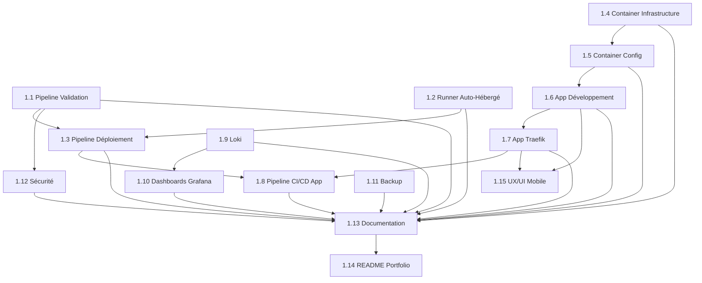

# Roadmap - Transformation Portfolio Infrastructure Professionnelle

**Version** : 1.1
**Dernière mise à jour** : 2026-03-09
**Epic** : [Transformation Portfolio Infrastructure Professionnelle](EPIC.md)

---

## Vue d'Ensemble

Ce document trace la progression de la transformation de l'infrastructure homelab en vitrine professionnelle. Le projet est organisé en 15 stories réparties en 5 phases.

**Objectif global** : Démontrer une maîtrise complète DevOps/SRE à travers un projet infrastructure concret, automatisé et documenté.

---

## Statut Global

| Métrique | Valeur | Cible |
|----------|--------|-------|
| Stories complétées | 12 / 15 | 15 |
| Stories en revue | 1 / 15 | - |
| Progression | ~80% | 100% |
| Phase actuelle | Phase 5 — Documentation & Polish | Phase 5 |
| Durée estimée restante | ~1 semaine | - |

**Dernière story complétée** : [Story 1.8 - Pipeline CI/CD App](story-1.8.md)
**En revue** : [Story 1.13 - Documentation](story-1.13.md)
**Prochaine action** : Merger 1.13, démarrer 1.14 et 1.15

---

## Phases du Projet

### 📊 Phase 1 : CI/CD Foundation ✅ Complète

**Objectif** : Établir les fondations du pipeline CI/CD automatisé

| Story | Priorité | Effort | Statut | Notes |
|-------|----------|--------|--------|-------|
| [1.1 - Pipeline de Validation Infrastructure](story-1.1.md) | P0 | 5 | ✅ Done | Workflows Terraform + Ansible |
| [1.2 - Runner Auto-Hébergé](story-1.2.md) | P0 | 3 | ✅ Done | Accès réseau local |
| [1.3 - Pipeline de Déploiement Automatisé](story-1.3.md) | P0 | 8 | ✅ Done | GitOps complet |

**Critères de validation Phase 1** :
- [x] Pipeline CI/CD fonctionnel end-to-end
- [x] Au moins 1 déploiement automatisé réussi
- [x] Rollback testé et opérationnel
- [x] Documentation pipeline créée

---

### 🚀 Phase 2 : Application Démo ✅ Complète

**Objectif** : Déployer une application moderne avec son pipeline complet

| Story | Priorité | Effort | Statut | Notes |
|-------|----------|--------|--------|-------|
| [1.4 - Container Application - Infrastructure Terraform](story-1.4.md) | P1 | 3 | ✅ Done | Nouveau container LXC |
| [1.5 - Container Application - Configuration Ansible](story-1.5.md) | P1 | 5 | ✅ Done | Provisioning Docker |
| [1.6 - Application de Démonstration - Développement Frontend/Backend](story-1.6.md) | P1 | 13 | ✅ Done | PriceSync React + API |
| [1.7 - Application de Démonstration - Intégration Traefik](story-1.7.md) | P1 | 5 | ✅ Done | SSL + routing demo.oldevops.fr |
| [1.8 - Application de Démonstration - Pipeline CI/CD](story-1.8.md) | P1 | 8 | ✅ Done | Build + Deploy app |

**Critères de validation Phase 2** :
- [x] Infrastructure container déployée (Terraform + Ansible)
- [x] Application PriceSync développée et intégrée (React + API + Traefik)
- [x] Application accessible via `https://demo.oldevops.fr`
- [x] Pipeline CI/CD app fonctionnel
- [x] Tests >60% coverage

**Risques Phase 2** :
- 🟡 Docker dans LXC ne fonctionne pas → Mitigation : Vérifier nesting + fallback privileged
- 🟡 Certificats SSL non générés → Mitigation : Vérifier DNS OVH + Traefik logs

---

### 📈 Phase 3 : Observabilité Avancée ✅ Complète

**Objectif** : Implémenter une stack d'observabilité professionnelle

| Story | Priorité | Effort | Statut | Notes |
|-------|----------|--------|--------|-------|
| [1.9 - Monitoring Avancé - Loki pour Agrégation de Logs](story-1.9.md) | P2 | 5 | ✅ Done | Logs centralisés |
| [1.10 - Monitoring Avancé - Dashboards Grafana Versionnés](story-1.10.md) | P2 | 5 | ✅ Done | Dashboards IaC |

**Critères de validation Phase 3** :
- [x] Loki collecte logs de tous les containers
- [x] 3 dashboards Grafana créés et provisionnés
- [x] Logs interrogeables dans Grafana Explore
- [x] Dashboards versionnés dans Git

---

### 🔒 Phase 4 : Opérations et Sécurité ✅ Complète

**Objectif** : Sécuriser et rendre l'infrastructure résiliente

| Story | Priorité | Effort | Statut | Notes |
|-------|----------|--------|--------|-------|
| [1.11 - Backup et Disaster Recovery Automation](story-1.11.md) | P2 | 8 | ✅ Done | Backup auto + DR |
| [1.12 - Sécurité - Scanning et Hardening Automatisé](story-1.12.md) | P2 | 8 | ✅ Done | Security scans |

**Critères de validation Phase 4** :
- [x] Backup quotidien fonctionnel
- [x] Test de restoration réussi (RTO <30min)
- [x] Scans de sécurité passent (pas de vulns critiques)
- [x] Hardening appliqué sur tous les containers

---

### 📚 Phase 5 : Documentation et Polish 🏗️ En cours

**Objectif** : Finaliser la vitrine professionnelle

| Story | Priorité | Effort | Statut | Notes |
|-------|----------|--------|--------|-------|
| [1.13 - Documentation Professionnelle - Architecture et Runbooks](story-1.13.md) | P3 | 8 | 🔄 In Review | Docs exhaustives |
| [1.14 - README et Portfolio - Transformation en Vitrine Professionnelle](story-1.14.md) | P3 | 5 | 📝 Todo | README + portfolio |
| [1.15 - PriceSync — Optimisation UX/UI Mobile & Navigation Smartphone](story-1.15.md) | P3 | 5 | 📝 Todo | Responsive + hamburger + tactile |

**Critères de validation Phase 5** :
- [ ] Documentation complète (architecture + runbooks + guides)
- [ ] README transformé en vitrine professionnelle
- [ ] Page portfolio créée dans l'app
- [ ] SHOWCASE.md créé
- [ ] Script vidéo préparé
- [ ] Application PriceSync utilisable sur smartphone (demo.oldevops.fr)

**Risques Phase 5** :
- 🟢 Documentation obsolète → Mitigation : Revue régulière + CI/CD checks

---

## Légende des Statuts

- 📝 **Todo** : Story non démarrée
- 🏗️ **In Progress** : Story en cours de développement
- 🔄 **In Review** : Story en revue (PR ouverte)
- ✅ **Done** : Story complétée et mergée
- ⏸️ **Blocked** : Story bloquée (dépendances ou problème)
- ❌ **Cancelled** : Story annulée

## Légende des Priorités

- **P0** : Bloquant - requis pour la suite
- **P1** : Haute - fonctionnalités core
- **P2** : Moyenne - améliorations importantes
- **P3** : Basse - polish final

## Légende des Risques

- 🔴 **Élevé** : Impact majeur, nécessite attention immédiate
- 🟡 **Moyen** : Impact modéré, mitigation en place
- 🟢 **Faible** : Impact mineur, gérable

---

## Dépendances entre Stories

```mermaid
graph TD
    A[1.1 Pipeline Validation] --> D[1.3 Pipeline Déploiement]
    B[1.2 Runner Auto-Hébergé] --> D
    D --> H[1.8 Pipeline CI/CD App]

    E[1.4 Container Infrastructure] --> F[1.5 Container Config]
    F --> G[1.6 App Développement]
    G --> I[1.7 App Traefik]
    I --> H
    G & I --> P[1.15 UX/UI Mobile]

    J[1.9 Loki] --> K[1.10 Dashboards Grafana]

    A --> L[1.12 Sécurité]

    A & B & D & E & F & G & I & H & J & K & M[1.11 Backup] & L --> N[1.13 Documentation]
    N --> O[1.14 README Portfolio]
```

---

## Métriques de Succès du Projet

### Métriques Techniques

- [x] Pipeline CI/CD complet (Stories 1.1-1.3 Done)
- [x] Application déployée accessible via HTTPS avec SSL valide (demo.oldevops.fr)
- [x] Monitoring avec dashboards + logs centralisés opérationnel (1.9, 1.10 Done)
- [x] Test de restoration backup <30 min (RTO) (1.11 Done)
- [x] Aucune vulnérabilité critique (CVSS ≥9.0) non justifiée (1.12 Done)
- [x] Tous les tests automatisés passent (>60% coverage)

### Métriques Documentation 📚

- [ ] README avec badges et diagrammes professionnels (1.14 Todo)
- [ ] Documentation complète (architecture + runbooks + ADRs) (1.13 In Review)
- [ ] Portfolio interactif démontrant les compétences (1.14 Todo)
- [ ] Script vidéo de démonstration préparé (1.14 Todo)
- [ ] 100% des critères d'acceptation validés

### Métriques Business 💼

- [ ] Projet présentable à des recruteurs
- [ ] Compétences DevOps clairement démontrées
- [ ] Décisions architecturales justifiées et documentées
- [ ] Résultats mesurables disponibles (uptime, performance)

---

## Changelog de la Roadmap

| Date | Version | Changements | Auteur |
|------|---------|-------------|--------|
| 2026-01-07 | 1.0 | Création initiale de la roadmap | Agent PM |
| 2026-03-09 | 1.1 | Mise à jour des statuts réels (12 Done, 1 In Review) + ajout Story 1.15 UX/UI Mobile | Agent PO |

---

## Prochaines Actions

### Immédiat
1. 🎯 Merger la PR en revue : 1.13 (Documentation)

### Court terme
1. Démarrer Story 1.14 : README et Portfolio
2. Démarrer Story 1.15 : UX/UI Mobile (demo.oldevops.fr)
3. Valider la Phase 2 complète (application accessible sur demo.oldevops.fr)

### Validation finale
1. Compléter Phase 5 (Documentation + Polish + Mobile)
2. Vérification complète sur appareil réel (smartphone)
3. Revue portfolio par un tiers

---

## Références

- [PRD complet](../prd.md)
- [Epic principal](EPIC.md)
- [Stories individuelles](.) (fichiers story-1.X.md)
- [README projet](../../README.md)

---

**Note** : Cette roadmap est un document vivant mis à jour au fur et à mesure de la progression du projet.

**Prochaine revue** : Après merge de la PR 1.13 et démarrage de 1.14 + 1.15
